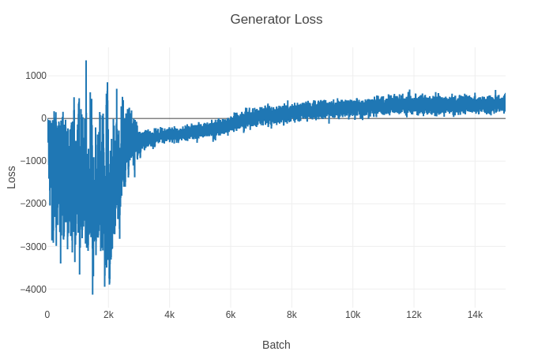
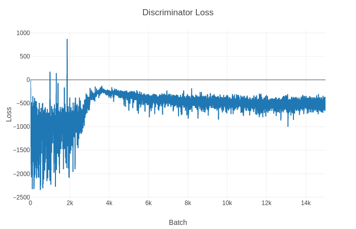
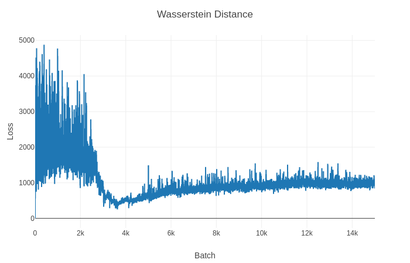

# text-wgan
Improved Training of Wasserstein GANs for Text

WIP!

Based on the paper [Improved Training of Wasserstein GANs](https://arxiv.org/abs/1704.00028).






Sample after 15000 iterations

```
this shere pmongerin liked braning sith ang and and bod whosd by ic-t andoningl, ames like this to kookt marmangenedcoy wing the lemest celic iating telike harhart to be eyentinlto ok wigical eaitly is lmdoincti isclederling tleads of the vidtlin-anew,.he mostedion has cebiche i

oover stortly whiting eventa fot and and purvingshing dovarnyy marming, and dood the e.rit ond grases in ane the dannierdey. tris cootied arneges. wrath bad and dcting. made...t suming but dilting actins woat get ooemouthgind good cran tion and d vared intaliit,stming i sad ge ge

somd. ao, me dencan,i huck on the patfar its doscate must rusel, a deul the pont of hesvel, any me sage movie mame it was allmovce his was poring, evellever vowe risuide a r wancidery hen onemor ie, in that wastany no e sate funmout this moveestink, medes film, is.n, i an pre is
```

## References

Based on the following implementations

- [caogang/wgan-gp](https://github.com/caogang/wgan-gp)
- [igul222/improved_wgan_training](https://github.com/igul222/improved_wgan_training)
- [martinarjovsky/WassersteinGAN](https://github.com/martinarjovsky/WassersteinGAN)
